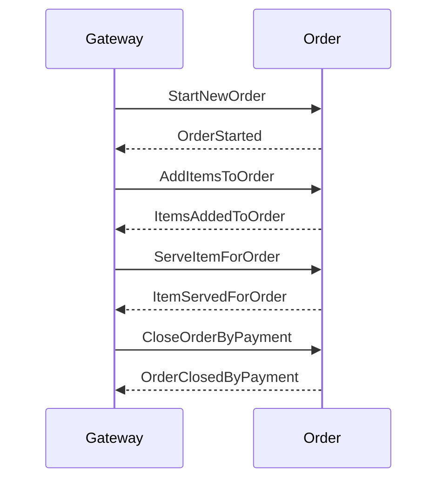

# "Food Order" Domain Microservices Example
**v1.0  - (c) 2021, Axis Group, LLC** - Internal Education, Training, Recruiting Diagnostics, & Grading Project

Welcome to the Axis Group "Food Order" Domain Microservices example project. This project presents a domain modeling scenario and foundational code to simulate a simple microservices model within a single, in-process, self-contained .NET 5 solution. The architectural objective of this project is to present an implementation example that:
 - Is primarily written using C# and .NET 5, including a variety of recent features from C# 8.0 and 9.0
 - Demonstrates (at least partially) functional approaches and techniques within C#
 - Leverages Command-Query Responsibility Segregation (CQRS) and Event Sourcing (ES) patterns
 - Performs asynchronous message publishing and handling, including basic orchestration (in-process via MediatR)
 - Uses Dependency Injection with the built-in ASP .NET Core DI container
 - Respects microservice concepts regarding inter-service data sovereignty (within example constraints)
 - Uses an event and document store for data persistence (transiently per-execution via in-memory SQLite)
 - Provides a Swagger-based UI/gateway for interacting with services

This project is intended for internal use at Axis Group for education and training, and for external recruiting and diagnostics purposes with Axis Group permission, subject to the constraints of the provided license. While we actively encourage learning, education, and professional development, including through the use and creation of derivative works related to this project, this project is subject to being continuously improved and updated, uses design choices selected to show a variety of capabilities, and does not reflect a production-ready or exhaustive microservices architecture implementation. A more permissive license may be available in the future and we appreciate your support in not re-distributing this project or its resources publicly at this time, in source or compiled form.

## Basic Domain Scenario

A food truck, known best for its 1/3rd pound burger combo, has a simple ordering system in place. The UI allows new orders to be created, items to be added to an order, ordered items to be served, and for the order to be closed via a payment. Each step of this process is currently manually managed by the user at the single UI. The food truck is expanding its business into a small kitchen and will be separating the process for taking & serving orders from the preparation of ordered menu items. Through an update to its system, the Food Order platform should support automatically updating the existing order service when items are ready to be served.

## Basic Domain Requirements
-   An order with a unique order number must be started before items can be added. 
	- Items can be added to an order for as long as the order remains open.
-   No refunds or cancellations! Once an item is placed for order, it will always be prepared.
-   Beverages can be filled immediately by the responsible service upon request.
-   Food items must be prepared. 
	- This process should take at least 10s. 
	- The responsible service should generate a notification both when prep has started and when the food is ready.
-   An order can only be closed with an exact payment and only when all ordered items have been served

## Implementation Guidelines

-   New capabilities should be added using one or more new "microservice" libraries similar to the "Order" service and implemented using the patterns for command, event, and query handling presented in the existing code.
-   New service(s) do not need to use event sourcing for managing their internal state and any work time can be simulated with a wait or delay.
-   You may modify the existing order service, including its integration and domain events, messages, and objects.
-   You may modify the existing Shared capabilities, including the patterns for the event and document stores
-   HINT: The order service can consume integration commands and events from itself to trigger orchestrated operations

## Existing Interaction Diagram (Success)

## Advanced Domain Opportunities
 - Allow cancellation of unserved food items
 - Add discounts, coupons, tipping, or more payment options
 - Implement a persistent data store
 - Transition the domain to separate services using a standalone message bus
 - Create a service for managing the menu
 - Add a customer rewards service
 - Allow menu items to be pre-staged for service
 - Support scheduled or "call-ahead" orders
 - Track the daily till, including costs & profits
